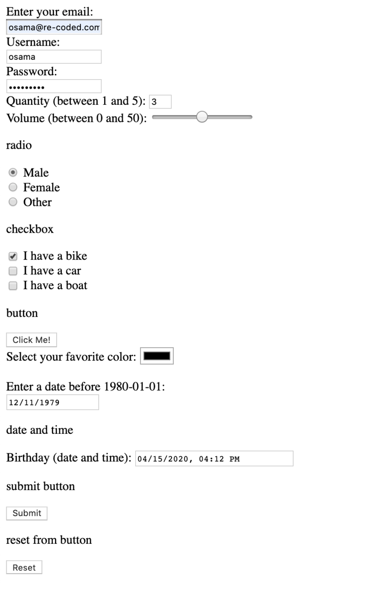

# Building HTML form

## Overview

A long your career as a Frontend Web Developer, you will be working on a lot of forms. Forms are used to take information from the user and send it to the server for processing.

In this lab you will be working in pairs to make the form in the image below.

